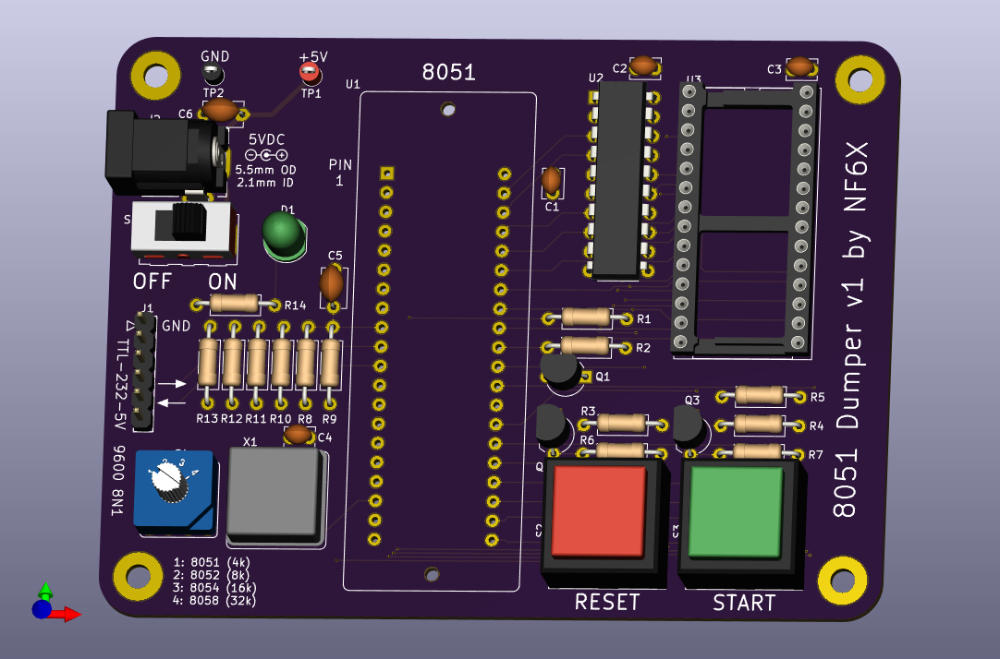
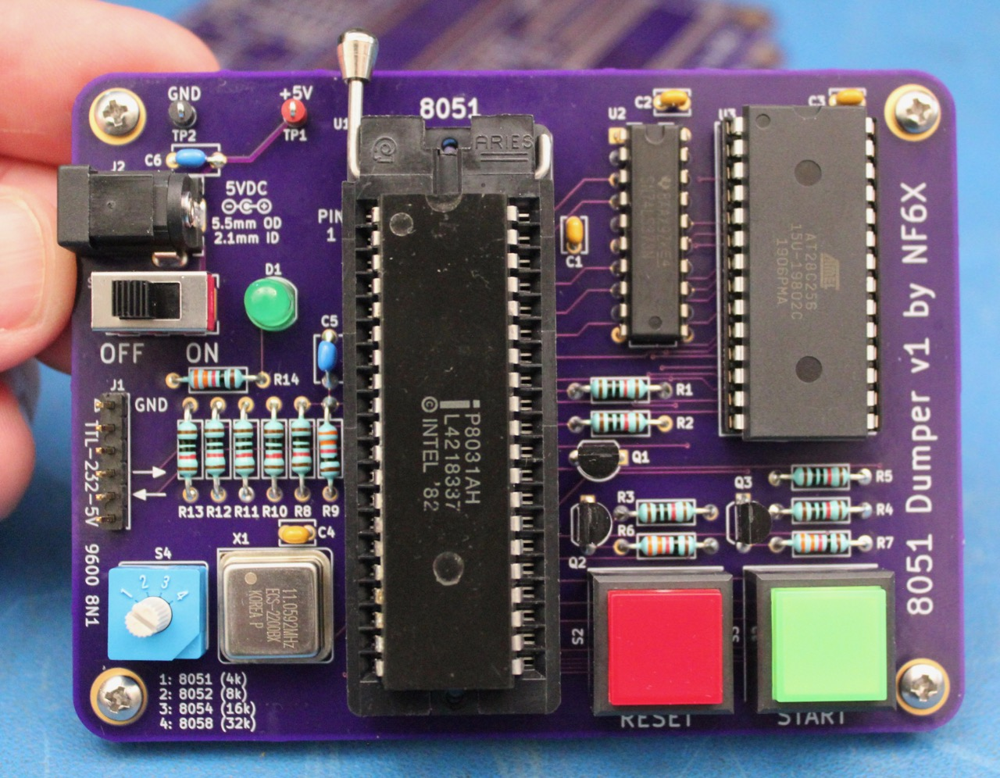
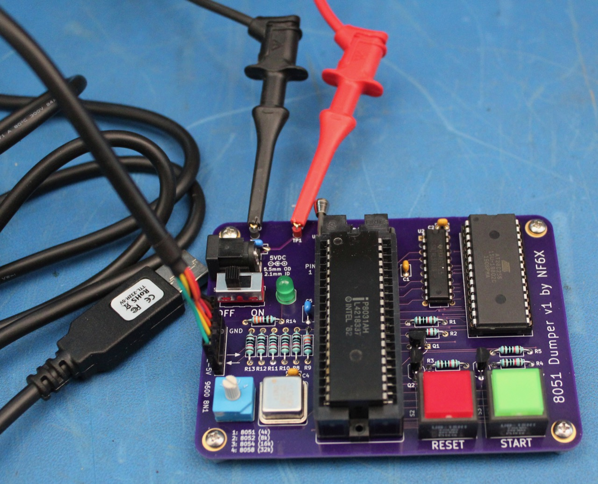

# 8051dumper: Dump ROM contents from unprotected 8051 series processors.

This board and firmware allow the mask-programmed ROM contents to be dumped from
[Intel 8051 processors](https://en.wikipedia.org/wiki/Intel_MCS-51) and
derivatives/clones which do not include ROM readout protection mechanisms.

## Description

I wanted to dump out the firmware from the internal mask ROM of a Signetics
SCN8051H microcontroller in an ailing Micropolis 1325 (AKA DEC RD53-A) hard disk
drive. None of my programmers are able to do that, but there's a tricky way to
get early 8051 microcontrollers to dump out their own firmware. I made this
board to do it... and over-engineered the heck out of it, because why not! This
technique has been around for a long time. I didn't invent it. I just made this
board because I'd rather lay out a board than wire up stuff on a breadboard.

The 8051 has a pin called EA\# which tells it whether to fetch code from its
internal ROM (which is programmed at the metal mask layer at chip fabrication
time) or an external ROM. The trick is to put the 8051 into a circuit which
initially pulls EA\# low, so that the 8051 will boot from an external ROM with
our dumper code in it. That code immediately jumps out of the 4k address range
that is mapped to internal ROM when EA\# is high, and then uses a GPIO pin to
pull its own EA\# pin high and re-enable the internal mask ROM. At that point,
the 8051 conveniently fetches program memory accesses in the 0x0000-0x0FFF range
from the internal ROM, and fetches program memory accesses outside that range
from our external ROM. The special dumper code on our external ROM can then use
the MOVC function to read internal ROM bytes, and then dump them out somehow
(such as with the built-in serial port).

The 8052, 8054 and 8058 chips have larger internal ROM spaces, but otherwise
work the same way. Just for the heck of it, I put a knob on this board to tell
its firmware how much of the internal ROM space it should try to dump.

Later 8051 derivatives added features to prevent dumping their internal ROMs
easily, sunce as simply latching EA\# at reset time so that changing it later
doesn't do anything. This board can't work with any of those. It's only intended
to work with original Intel 8051 microcontrollers and exactl clones whose EA\#
pins behave the same way.

## Building the Board

You're on your own for assembling the board. You will need to program the
board's firmware into an AT28C256 (or plug-in equivalent) 32k x 8 (E(E))PROM.
Use the `firmware/8051dumper_filled.hex` image. This image contains the
necessary firmware for the 8051dumper board, with its unused areas filled with a
recognizable pattern to help you identify whether any given device under test is
dumping internal or external ROM contents.

## Using the Board

This board requires an external source of clean, regulated 5 VDC power, and some
sort of asynchronous serial interface with 5V TTL/CMOS signal levels. An FTDI
TTL-232R-5V cable can be pluged right into the header, or you can use clip
leads. The silkscreen markings identify the ground pin and the two data pins.

**There is no reverse-polarity protection, power regulation, or overvoltage protection on this board.** You need to connect the power correctly, or you will fry stuff. You can supply power through either the barrel jack or with clip leads
connected to the two test points.

Set your serial interface for 9600 baud, 8 data bits, no parity, and no flow
control. Use a terminal emulator or any other suitable software which can
capture the 9600 baud stream from 8051dumper.

Always make sure that the power switch is **OFF** before installing or removing
a device under test from 8051dumper.

If all goes well, when you turn on the board with a working [8051 (or other
MCS-51 series)](https://en.wikipedia.org/wiki/Intel_MCS-51) microcontroller
installed, the green START button will begin blinking and the serial port will
spit out `8051dumper v1.0 by NF6X`. If that doesn't happen at power-on, try
pressing the red RESET button to reset the microcontroller manually. If it still
doesn't happen, start debugging. Maybe the socket isn't making good contact?
Maybe, well, literally anything else has gone wrong?

Once the green START button is blinking, set the knob to the appropriate ROM
size and then press the green START button to begin the dump. While the dump is
in progress, the red RESET button will flash rapidly. When the dump is done, the
red RESET button will go dark and the green START button will light up. Now you
can turn off the board, or press RESET to do it all over again.

The 8051dumper output is in [Intel hex](https://en.wikipedia.org/wiki/Intel_HEX)
format. If you try dumping beyond the end of the internal ROM, or if you try
dumping from a device which latches EA\# at reset time, then some or all of the
output will be from the 8051dumper's own external ROM instead of the device
under test's internal ROM. To help you indentify when this happens, the unused
spaces of 8051dumper's ROM are filled with a pattern which is recognizable in
either hexadecimal or ASCII representations, and repeats every 16 bytes:

* Address (2 bytes)
* 0x00
* 0x80
* 0x51
* 0x00
* "8051dumper"

